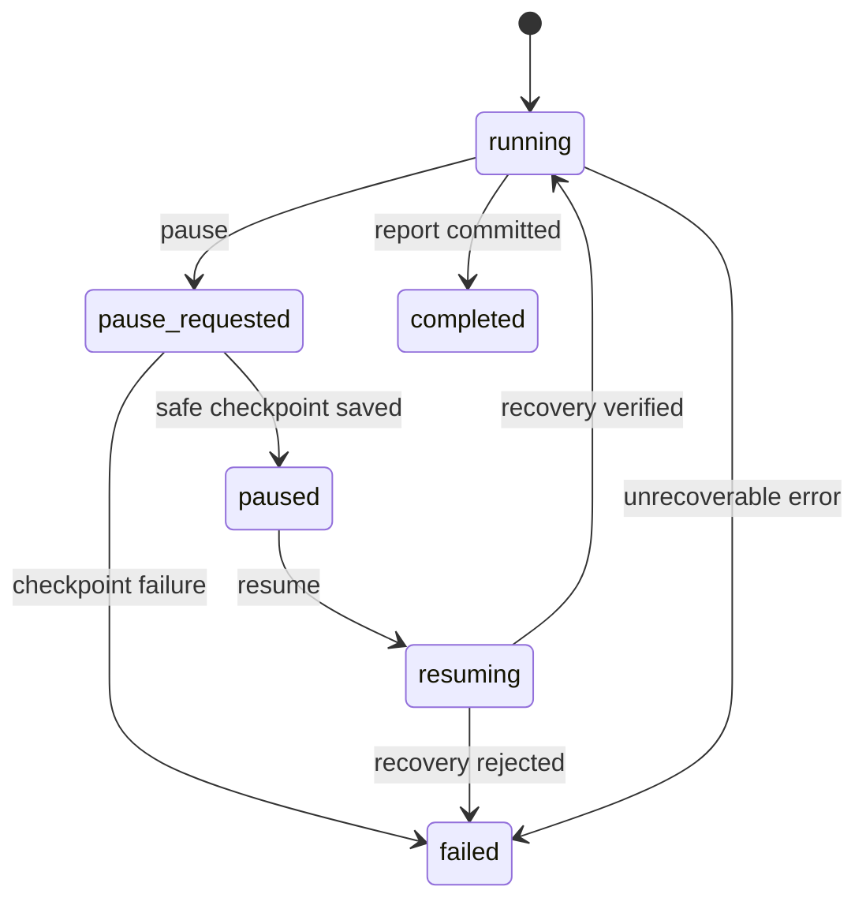

# Durable Financial Research Agent 架构设计

> 状态：核心架构 v1 已冻结；非阻塞产品决策按 ADR 延期
> 更新时间：2026-08-11
> 目标：把当前 Demo 演进为一个可恢复、可验证、可评测、可解释的金融研究 Agent，同时保留适合面试演示的工程边界。

## 1. 项目定位

本项目不是“套一层聊天界面的金融问答”，而是一套可审计的研究任务执行系统：用户提出公司研究问题，系统识别意图与实体，必要时确认，生成动态任务计划，在权限和预算约束下调用工具，持续保存进度，根据观察结果重新规划，验证证据后流式生成报告，并留下完整的运行记录与评测结果。

核心价值不是一次回答得像不像，而是：

- 不该研究时不误触发昂贵工具；
- 研究过程可暂停、恢复和故障恢复；
- 每个结论能追溯到证据；
- 后续追问能延续同一研究上下文；
- 架构决策、质量、成本和失败模式都可量化。

第一阶段采用模块化单体，不急于拆微服务或多 Agent。只有评测证明拆分能改善质量、吞吐或隔离性时，再做演进。

## 2. 当前 Demo 与目标差距

当前版本已经具备基础聊天界面、研究流程演示和 DeepSeek 调用，但主要还是一次性请求链：进程内状态较多，工具和证据体系较弱，缺少可靠恢复、长期记忆、文档检索、严格意图门控与系统化评测。

目标版本需要补齐六类能力：

1. **控制面**：状态机、计划、预算、权限、暂停和恢复；
2. **数据面**：数据库、文档快照、证据、报告版本；
3. **认知面**：分层意图识别、上下文构建、规划与重新规划；
4. **记忆面**：运行记忆、短期记忆、长期记忆及其写入治理；
5. **工具面**：稳定契约、幂等、超时、重试、降级与追踪；
6. **质量面**：证据验证、离线评测、故障注入和可观测性。

## 3. 总体执行链

```mermaid
flowchart TD
    U[\"用户消息\"] --> S[\"读取当前会话与短期记忆\"]
    S --> R[\"分层意图路由\"]
    R -->|社交/控制/确认| D[\"直接响应或更新运行状态\"]
    R -->|研究问题| E[\"公司与证券实体解析\"]
    E --> C{\"身份是否明确\"}
    C -->|否| Q[\"请求用户确认\"]
    C -->|是| M[\"检索经验证的长期记忆\"]
    M --> X[\"Context Builder\"]
    X --> P[\"Planner 生成任务 DAG\"]
    P --> G[\"权限与预算检查\"]
    G --> T[\"并行/串行工具执行\"]
    T --> K[\"原子持久化步骤、观察和检查点\"]
    K --> V{\"证据是否充分\"}
    V -->|不足且预算允许| P2[\"至多一次重新规划\"]
    P2 --> G
    V -->|充分| EV[\"Claim-Evidence 验证\"]
    EV --> O[\"流式报告\"]
    O --> SM[\"更新短期记忆\"]
    SM --> LM[\"后台长期记忆整合\"]
    LM --> A[\"审计、指标与离线评测\"]
```

SSE 事件流和审计日志贯穿全链路。数据库是运行状态的唯一事实源；内存缓存、全文索引和向量索引都可以重建，不能反过来成为事实源。

## 4. 模块边界

```text
API / SSE
├── Conversation Service
├── Intent Router
├── Entity Resolver
├── Context Builder
├── Planner
├── Policy & Budget Gate
├── Durable Runner
│   ├── Executor
│   ├── Checkpoint Manager
│   └── Recovery Manager
├── Tool Registry
├── Evidence & Verifier
├── Report Composer
├── Memory Service
├── RAG / Document Service
├── Evaluation Service
└── Repository / Event Store
```

模块化单体的边界必须通过接口和数据库事务体现，而不是仅用目录命名。模型不直接操作数据库、状态机或任意网络资源，只能调用注册工具。

## 5. 分层意图路由：先判断要不要研究

### 5.1 设计原则

意图识别不应让大模型直接接管，更不能每收到一句话就调用研究工具。路由采用“规则层 → 上下文层 → 受限分类器”的漏斗：

1. **规则层**：处理明确的感谢、确认、暂停、恢复、状态查询和显式研究请求；
2. **上下文层**：结合当前 case、运行状态、待确认问题和最近报告，判断后续追问；
3. **受限分类器**：只处理仍然模糊的少量请求，输出严格枚举，不允许调用工具或写长期记忆。

“规则 90% / 上下文 8% / 分类器 2%”是目标分布，需要通过真实流量测量，不能当成已经实现的事实。

### 5.2 意图枚举

```text
SOCIAL_ACK         感谢、结束语、简单社交回应
CONTROL            暂停、恢复、查询状态等控制命令
CONFIRMATION       回答系统正在等待的确认问题
REPORT_QA          仅基于现有报告和证据回答
RESEARCH_FOLLOWUP  延续当前 case，需要补充研究
RESEARCH_NEW       新建研究 case
CLARIFICATION      系统需要澄清用户意图
OUT_OF_SCOPE       超出产品边界
AMBIGUOUS          仍无法可靠判定
```

优先级为：待确认回答 > 控制命令 > 显式研究请求 > 报告追问 > 社交消息 > 模糊消息。

### 5.3 路由契约

```json
{
  "intent": "RESEARCH_FOLLOWUP",
  "confidence": 0.96,
  "case_id": "case_123",
  "requires_planner": true,
  "external_research_allowed": false,
  "response_policy": "enqueue_at_safe_checkpoint",
  "reason_codes": ["ACTIVE_CASE", "EXPLICIT_ANALYSIS_VERB"]
}
```

只有 `RESEARCH_NEW` 和 `RESEARCH_FOLLOWUP` 能进入 Planner，且仍需通过实体确认、运行状态、权限和预算检查。`REPORT_QA` 优先使用已有证据，不能偷偷发起网络搜索。

Router 只识别是否需要 Planner，不授予外部工具执行权限。因此 Phase 2 的所有 `RouteDecision.external_research_allowed` 均为 `false`；Phase 3 只有在实体、权限和预算门禁通过后才能产生独立的执行授权。

### 5.4 上下文例子

- 报告完成后用户说“好的，谢谢”：`SOCIAL_ACK`，使用上下文模板回复，不调用模型和工具。
- 系统询问“是 A 股的比亚迪吗？”后用户说“是的”：`CONFIRMATION`，绑定实体并继续原任务。
- 任务运行中用户说“再看看现金流”：`RESEARCH_FOLLOWUP`，保存为待处理指令，在安全检查点重新规划，不重复创建整套任务。
- 报告完成后用户问“那现金流呢？”：现有证据充分时走 `REPORT_QA`；不足时转 `RESEARCH_FOLLOWUP`；实体或期间不清时先澄清。

### 5.5 受限分类器边界

分类器即使由 LLM 实现，也必须满足：无工具、无网络、无长期记忆写入、短超时、低 token、严格 JSON Schema、只返回意图枚举和理由码。分类失败默认进入澄清，不能默认进入研究。

已决定首版关闭受限 LLM 分类器，只使用规则层和上下文层；仅未来的量化启用阈值待定。启用前必须证明它提高模糊请求召回，同时“错误触发研究工具率”仍接近 0。

## 6. 公司与证券实体解析

公司与上市证券必须分开建模，因为同一公司可能存在 A/H/美股等多个证券，财报口径、币种和交易所也不同。

Resolver 输出：

```json
{
  "company_id": "company_byd",
  "company_name": "比亚迪股份有限公司",
  "security_id": "security_002594_sz",
  "ticker": "002594",
  "exchange": "SZSE",
  "market": "CN_A",
  "currency": "CNY",
  "confidence": 0.99,
  "requires_confirmation": false,
  "candidates": []
}
```

低置信度、多候选、跨市场同名或用户修正时必须确认。确认结果写入当前 case 的短期记忆；后续纠正需要使旧实体及其派生计划失效，并创建新的计划版本。

## 7. Planner 与动态任务 DAG

Planner 接收结构化目标、确认实体、时间范围、短期摘要、可用工具、权限和预算，输出可验证的任务 DAG，而不是自由文本步骤。

```json
{
  "plan_id": "plan_123",
  "version": 2,
  "goal": "分析公司近三年盈利质量及主要风险",
  "steps": [
    {
      "step_id": "s1",
      "kind": "retrieve_filings",
      "dependencies": [],
      "tool": "search_filings",
      "input": {"document_types": ["annual_report"]},
      "success_criteria": ["至少获得两个年度的正式财报"],
      "max_attempts": 2,
      "estimated_cost": 1
    }
  ]
}
```

约束：

- DAG 必须无环，步骤 ID 唯一，依赖存在；
- 每步声明成功标准、最大尝试次数和成本；
- 计划版本不可原地覆盖；
- 并行只发生在无依赖冲突、预算允许的 frontier 中；
- 观察不足时最多自动重新规划一次，防止无限循环；
- Planner 失败可修复一次，仍失败则使用确定性的标准研究模板。

## 8. 运行状态机

### 8.1 用户要求的六个主状态

| 状态 | 内部值 | 含义 |
|---|---|---|
| 运行中 | `running` | 正在调度或执行步骤 |
| 待暂停 | `pause_requested` | 已收到暂停请求，等待安全检查点 |
| 已暂停 | `paused` | 状态已持久化，不再调度新步骤 |
| 恢复中 | `resuming` | 正在校验租约、检查点和未完成调用 |
| 执行失败 | `failed` | 发生不可恢复错误或预算耗尽 |
| 执行完成 | `completed` | 报告、证据和最终检查点均已保存 |



暂停是协作式暂停：正在执行的不可中断工具可以结束，但系统不再领取新步骤；保存结果和检查点后进入 `paused`。

#### 状态迁移契约

| 当前状态 | 命令/事件 | Guard | 目标状态 | 原子副作用 | 重复请求语义 |
|---|---|---|---|---|---|
| 无 | `create` | 请求合法、初始计划可创建，Runner 提供 `owner_id` | `running` | 同一事务创建 run、计划、初始 checkpoint、初始 lease 和 `run.started` | 相同幂等键返回原 run 及当前 lease 归属，不新建 lease |
| `running` | `pause` | 无 | `pause_requested` | CAS 更新状态和版本，写 `run.pause_requested` | 返回当前 run，不重复写事件 |
| `pause_requested` | `safe_checkpoint_saved` | 无 active step；checkpoint 已提交 | `paused` | 写 frontier、checkpoint、`run.paused` | 已 paused 时为 no-op |
| `paused` | `resume` | 存在可恢复 checkpoint | `resuming` | 获取/刷新 lease，写 `run.resuming` | 已 resuming 时返回当前 run |
| `running` / `pause_requested` | `lease_expired_recovery_claim` | lease 缺失或过期，且抢占事务写入 `recovery_required=1` | `resuming` | CAS 创建新 lease，保留原状态供恢复后重放暂停意图，写 `run.resuming` | 只有一个 owner 抢占成功，其余返回冲突 |
| `resuming` | `recovery_verified` | 计划、frontier、调用账本一致 | `running` | 提交恢复 checkpoint，写 `run.running` | 已 running 时为 no-op |
| `running` | `report_committed` | 报告、claims、evidence、最终 checkpoint 已提交 | `completed` | 写 `report.completed`、`run.completed` | 返回已完成结果 |
| `running` / `pause_requested` / `resuming` | `unrecoverable_error` | 错误可被数据库记录 | `failed` | 写错误摘要、恢复建议、`run.failed` | 已 failed 时不重复写事件 |

非法迁移统一返回 `409`，不改变状态。`paused` 收到 `pause` 视为幂等成功；`running` 收到 `resume` 仅在该请求对应同一已完成恢复操作时幂等成功，否则为 `409`。`completed` 和 `failed` 是不可变终态，除查询外拒绝控制命令。

并发不变量：

- `agent_runs.state_version` 每次迁移加一，更新使用 `WHERE id = ? AND state = ? AND state_version = ?` 的 CAS；受影响行数为零表示并发冲突；
- 同一 run 同时最多一个有效 lease；lease 带 `owner_id`、`lease_token`、`expires_at`，执行器只在 token 匹配时提交步骤；
- API 不直接插入 `running` run，而是调用 Runner 的 `create_run(owner_id, idempotency_key, ...)`；初始 lease 与 run 在同一事务提交，任一写入失败则整个创建失败；lease token 只返回给内部执行器，不暴露给客户端；
- 执行器在租期不足以覆盖下一次安全提交时先续租；只有 lease 过期后，其他 owner 才能抢占；
- 抢占者必须先进入恢复校验，不能直接领取新步骤；
- 进程启动时，reconciler 扫描所有非终态且 lease 缺失或过期的 run，以 CAS 抢占 lease 并进入恢复校验；数据库恢复后的 `recovery_required` 也由该扫描发现；
- `pause_requested` 提交与步骤完成提交竞争时都使用 CAS：步骤结果可以保存，但提交后不得领取新步骤，并由胜出的事务计算最新 frontier；
- 终态的执行结果、已成功步骤和已成功工具调用不可被降级或覆盖；完成后的证据元数据补全只能创建带 before/after hash 的新 checkpoint 与审计事件，不得重开执行或覆盖原始证据内容。

### 8.2 步骤状态

```text
pending -> ready -> running -> succeeded
                           -> retry_wait -> ready
                           -> failed
pending/ready -> skipped
```

步骤状态与运行状态分离。运行暂停不等于正在运行的步骤失败。

### 8.3 待决：是否增加 cancelled

永久停止与临时暂停语义不同。推荐增加第七个终态 `cancelled`，以匹配 UI 的“停止任务”能力；如果产品必须严格只有六态，则 UI 只能提供暂停，不提供不可恢复的取消。该决定需单独形成 ADR。

## 9. 每步完成后的原子持久化

每次步骤完成，必须在一个数据库事务中写入：

- 运行和步骤状态；
- 步骤输入、规范化输出和错误；
- 工具调用参数、结果摘要、版本、耗时和成本；
- 新证据及来源；
- 已消耗预算；
- 当前计划版本和下一执行 frontier；
- 完整可恢复检查点；
- 对外事件记录。

只有事务提交成功，Executor 才能领取下一步。检查点保存失败时不得继续在内存里“悄悄运行”：当前事务回滚、执行器立即停止调度并写进程日志/监控告警。如果数据库仍可写，使用独立事务将 run 标记为 `failed`；如果数据库本身不可写，则保留最后一个已提交状态，由恢复器在数据库恢复后标记 `recovery_required` 事件并完成一致性检查，再决定恢复或转为 `failed`。因此系统绝不声称一个未成功持久化的 `failed` 状态已经生效。

### 9.1 执行指针

不要只保存单个 `next_step_id`。DAG 可能同时有多个可运行步骤，因此保存 frontier：

```json
{
  "plan_version": 2,
  "ready_step_ids": ["s3", "s4"],
  "running_step_ids": [],
  "blocked_step_ids": ["s5"],
  "completed_step_ids": ["s1", "s2"]
}
```

### 9.2 幂等与恢复

- 每个步骤和工具调用都使用稳定的 `idempotency_key`；
- 工具开始前保存调用意图，结束后保存结果；
- 恢复时先查询是否已有成功结果，再决定重试；
- 对不能保证幂等的外部调用，只允许人工确认或只读模式；
- Runner 使用租约避免两个进程同时恢复同一 run；
- 事件表采用单调递增序号，支持 SSE 从断点续传。

## 10. 记忆系统

记忆不是一张聊天记录表，也不是“把所有内容都塞进向量库”。它分成运行、短期和长期三个层级，并通过 Context Builder 按需读取。

### 10.1 Working Memory：单次运行

保存在 `AgentState` 和 checkpoint 中：目标、确认实体、计划及版本、frontier、步骤观察、预算、报告草稿、未解决问题。其生命周期是一次 run，必须完整可恢复。

### 10.2 Short-term Memory：case / 会话

包含：

- 最近对话与压缩摘要；
- 已确认的公司、市场、证券和研究期间；
- 用户纠正；
- 已研究和未解决问题；
- 当前证据账本；
- 最近报告及其版本；
- 失败或暂停位置；
- 待处理的后续研究指令。

它用于正确理解“那现金流呢”“继续”“好的”等追问，避免把每句话都当成新研究任务。

### 10.3 Long-term Memory：跨 case

| 类型 | 内容 | 写入原则 |
|---|---|---|
| 语义记忆 | 经验证的公司事实 | 必须有来源、日期、置信度和有效期 |
| 情景记忆 | 成功/失败的任务策略 | 不能当作公司事实引用 |
| 用户偏好 | 报告格式、关注指标等 | 仅显式偏好；按用户隔离 |
| 程序记忆 | Prompt、工具政策、流程 | 版本控制，不允许线上自动改写 |

推荐作用域：公开公司事实可共享；用户偏好、私人 case 和会话记忆必须按 `user_id/tenant_id` 隔离。

### 10.4 长期记忆写入流水线

```text
candidate -> source_check -> classify -> deduplicate
          -> temporal_check -> verifier -> verified
                                      -> rejected
verified -> superseded / deleted
```

只有 `verified` 状态能作为事实被检索。网页中的指令、无来源结论和模型推测不能直接写入。显式用户纠正可在线更新 case；报告中的事实与经验应在任务结束后后台整合。

### 10.5 Context Builder

每次模型调用前只构建最小、高信号上下文，检索顺序为：

1. 当前 run 状态；
2. 当前 case 摘要和最近关键轮次；
3. 经验证的公司事实；
4. 显式用户偏好；
5. 与当前任务相似的情景经验。

候选记忆按以下因素排序：相关性 × 来源权威度 × 置信度 × 新鲜度 × 市场/期间匹配度。不得直接拼接完整聊天历史，也不得保存隐藏思维链、密钥或敏感工具输出。

## 11. 数据库与存储

### 11.1 技术路线

- **本地单用户阶段**：SQLite 开启 WAL，保存业务事实；Milvus 保存可重建检索索引；
- **公开部署/多用户阶段**：PostgreSQL 保存业务事实，Milvus 独立扩展检索容量；
- Repository 层隔离方言，迁移使用 Alembic；
- 从第一天预留 `user_id`、`tenant_id` 和作用域字段，避免后续数据隔离返工。

SQLite 足够支撑作品演示和单进程可靠恢复。公开服务再迁 PostgreSQL，不能为了“企业感”过早增加运维复杂度。

### 11.2 领域表

| 领域 | 主要表 |
|---|---|
| 身份与会话 | `users`, `companies`, `securities`, `cases`, `conversation_turns`, `case_summaries` |
| 执行 | `agent_runs`, `plans`, `run_steps`, `tool_calls`, `checkpoints`, `events`, `budgets` |
| 报告与证据 | `reports`, `report_sections`, `claims`, `evidence`, `claim_evidence` |
| RAG | `documents`, `document_versions`, `document_chunks`, `document_tables`, `document_embeddings`, `ingestion_jobs` |
| 记忆 | `memory_items`, `memory_relations`, `memory_access_log`, `memory_write_jobs` |
| 评测与版本 | `eval_runs`, `eval_cases`, `eval_results`, `model_versions`, `prompt_versions`, `tool_versions` |

关键记录不可原地覆盖：计划、报告、文档和 Prompt 都使用版本号；状态变化和外部事件保留时间线。

### 11.3 文件和对象存储

PDF、HTML 快照、OCR 结果和大体积工具输出不直接塞进业务表：

- Demo：`backend/data/artifacts/...`；
- 生产：S3 兼容对象存储；
- 数据库保存 URI、SHA-256、原始 URL、发布时间、抓取时间、解析状态、页数、MIME 和版本。

内容哈希用于去重；来源内容变化时创建新版本，绝不覆盖历史快照，以保证旧报告仍可复现。

## 12. RAG 设计

RAG 服务于已归档财报、公告、研究文档、当前 case 证据和经验证长期记忆。最新网页仍由实时搜索负责；高质量网页经过验证后才可进入文档库。

### 12.1 文档摄取

```text
发现来源 -> 下载并保存快照 -> SHA-256 去重/版本化
-> PDF/HTML 解析 -> 元数据提取 -> 结构化分块
-> 质量检查 -> Milvus BM25 sparse + dense 索引 -> ready
```

分块按标题、章节、子章节、段落、表格和页码进行，不只按固定 token 切割。每个 chunk 保存文档版本、页码、章节路径、父块、来源 URL、发布日期和内容哈希。财务表格单独保存表头、单位、币种和页码，避免数值脱离语境。

### 12.2 检索链

```text
Planner 查询
-> 公司/市场/期间/文档类型过滤
-> Milvus BM25 sparse + dense vector retrieval
-> Reciprocal Rank Fusion（默认）
-> 权威度与新鲜度加权
-> 可选 rerank
-> 去重与来源多样性
-> 父级上下文扩展
-> Evidence Pack
```

根据 [ADR-0008](../adr/0008-use-milvus-hybrid-retrieval.md)，检索目标态固定为 Milvus 混合检索：BM25 sparse 与 dense embedding 两路召回，默认使用 RRF 融合。`WeightedRanker`、独立 reranker、索引类型和参数仍需通过固定评测集决定。关系数据库和对象存储是事实源，Milvus 只保存可重建索引。

### 12.3 RAG 评测

- 检索：Recall@5/10、MRR、nDCG、过滤准确率、重复率、来源多样性、p95 延迟；
- 端到端：引用覆盖率、语义支持度、数字溯源率、陈旧证据误用率、证据不足时拒答率；
- 消融实验：无 RAG、仅 FTS、仅向量、混合、混合加 rerank。

向量方案只有在关键集上稳定胜过 FTS，并且成本和延迟可接受，才进入主链。

## 13. 工具体系

### 13.1 第一版模型可调用工具

最小实现集：

1. `search_filings`：搜索官方财报和公告；
2. `search_web`：受控网页搜索；
3. `retrieve_documents`：从本地 RAG 检索；
4. `read_document`：读取指定文档、页面或章节；
5. `extract_financial_facts`：抽取带单位、期间和来源的财务事实；
6. `calculate_financial_metrics`：使用确定性代码计算指标。

后续可增加 `compare_periods`、`get_existing_evidence` 和 `request_clarification`。计算和格式转换优先用确定性代码，不交给 LLM 心算。

### 13.2 运行时内部能力

以下不是模型工具，避免模型绕过状态机：

```text
save_checkpoint, append_event, update_run_status, consume_budget,
register_evidence, write_memory_candidate,
acquire_run_lease, release_run_lease
```

后台/管理任务包括：`ingest_document`、`reparse_document`、`rebuild_fulltext_index`、`rebuild_embeddings`、`consolidate_memory`、`run_evaluation`、`backup_database`。

### 13.3 工具契约

每个工具必须声明：

```text
name, version, risk_level, timeout, max_retries, idempotent,
cost_class, requires_confirmation,
input_schema, output_schema, error_schema, fallback_policy
```

执行器还要实施参数长度限制、授权、域名/URL 检查、输出裁剪、敏感信息脱敏和全链路 trace。

### 13.4 工具完成标准

一个工具只有满足以下条件才算实现：

- 输入/输出 JSON Schema 测试；
- 正常、空结果、超时、429、500、格式异常和重复调用单测；
- 至少一条真实或可控沙箱集成测试；
- 故障注入与 fallback 测试；
- 记录成功率、p50/p95、成本、空结果率、重试率、降级率、重复执行率和结果相关性；
- trace 中可查输入摘要、输出摘要、工具版本、耗时、成本和错误。

第一阶段工具尽量只读。

## 14. 权限与预算

权限门控位于 Planner 和 Executor 之间，并在每次调用前重新检查。

意图权限矩阵：

| 意图 | 可读短期记忆 | 可读长期记忆 | 可调用外部研究工具 | 可写长期记忆 |
|---|---:|---:|---:|---:|
| `SOCIAL_ACK` | 是 | 否 | 否 | 否 |
| `CONTROL` | 是 | 否 | 否 | 否 |
| `CONFIRMATION` | 是 | 否 | 否 | 否 |
| `REPORT_QA` | 是 | 仅已验证事实 | 否 | 否 |
| `RESEARCH_FOLLOWUP` | 是 | 是 | 条件允许 | 任务结束后候选写入 |
| `RESEARCH_NEW` | 是 | 是 | 条件允许 | 任务结束后候选写入 |

预算至少包含：模型 token、外部搜索次数、文档读取页数、工具调用数、重试次数、重新规划次数和墙钟时间。预算耗尽时系统应生成带限制声明的部分报告，或明确失败，不能无限重试。

## 15. 证据模型与验证

工具结果不等于证据。进入报告前需规范化为 Evidence：

```json
{
  "evidence_id": "ev_123",
  "claim_type": "financial_fact",
  "value": 6023.2,
  "unit": "CNY million",
  "period": "FY2025",
  "company_id": "company_byd",
  "source_url": "https://example.com/report.pdf",
  "document_version_id": "dv_123",
  "page": 88,
  "quoted_text": "...",
  "published_at": "2026-03-30",
  "fetched_at": "2026-08-10T10:00:00+08:00",
  "confidence": 0.98
}
```

Verifier 检查：

- 主张是否至少有一条直接支持证据；
- 数字是否带期间、单位、币种和页码；
- 公司、证券和市场是否一致；
- 证据是否陈旧或已被新版本取代；
- 多来源是否冲突；
- 推断是否明确标为分析而非事实。

证据不足时最多触发一次重新规划；仍不足则降低结论强度、展示限制或拒绝给出该结论。

## 16. 流式输出与断线恢复

SSE 只传输已持久化事件，例如：

```text
run.started
intent.resolved
entity.confirmation_required
plan.created
step.started
tool.completed
checkpoint.saved
run.pause_requested
run.paused
run.resuming
run.running
report.delta
report.completed
run.failed
run.completed
```

每条事件带 `event_id`、`run_id`、序号、时间和负载版本。客户端用 `Last-Event-ID` 续传；SSE 断线不终止后台任务，前端还可轮询 run 状态。报告 delta 需要可重放或至少能从已保存的报告快照恢复。

## 17. 降级与失败矩阵

| 故障 | 首选处理 | 备用方案 |
|---|---|---|
| 实体不确定 | 返回候选 | 用户确认 |
| Planner 输出非法 | 修复一次 | 确定性标准计划 |
| DeepSeek 失败 | 有界重试 | 用已持久化证据生成部分结果 |
| 网页搜索失败 | 重试/换来源 | 本地 RAG 或缓存官方财报 |
| RAG 检索失败 | 记录降级 | 受控实时搜索 |
| Embedding 失败 | 跳过向量 | FTS/BM25 |
| Reranker 失败 | 跳过重排 | 确定性 RRF 排序 |
| FTS 索引损坏 | 标记维护 | 元数据 SQL 查询并后台重建 |
| PDF 文本解析失败 | OCR | 保留原文件并标记未解析 |
| 单一网页失败 | 换官方/镜像来源 | 显式缺失 |
| 长期记忆不可用 | 关闭长期记忆 | 仅用 case 短期记忆 |
| checkpoint 保存失败 | 回滚并停止调度；写日志/告警 | DB 可写则独立事务转 `failed`；不可写则恢复后 reconcile |
| SSE 断线 | 后台继续 | 轮询 + `Last-Event-ID` |
| 数据库锁冲突 | 有界退避重试 | 明确失败，不转内存模式 |
| Verifier 不通过 | 重新规划一次 | 部分报告/拒绝结论 |
| 所有外部来源失败 | 保存失败证据 | 明确失败，不编造报告 |

所有降级结果统一带：`degraded`、`degraded_reason`、`fallback_used`。每条 fallback 都必须有自动化测试或故障注入验证。

## 18. 安全与治理

- 网页、PDF 和工具输出全部视为不可信数据，不能把其中指令当系统命令；
- URL 工具防 SSRF：协议白名单、DNS/IP 私网检查、重定向限制、响应大小和页数限制；
- 工具按风险分级，首版只读；高风险调用必须用户确认；
- API Key 只来自服务端环境变量，日志和事件统一脱敏；
- 所有数据查询带用户/租户作用域，防止跨用户记忆泄漏；
- 支持记忆查看、纠正、删除、TTL 和保留策略；
- 生产数据加密和备份恢复需单独验收；
- 记录 model、prompt、tool、parser 和 schema 版本；
- 不保存或展示隐藏思维链，只保存结构化决策理由、计划、观察和证据。

## 19. 可观测性与评测

### 19.1 运行指标

- 意图路由准确率和分层命中分布；
- 错误触发研究工具率，目标接近 0；
- 漏掉真实研究请求率；
- 计划成功率、重规划率和平均 DAG 深度；
- 工具成功率、重试率、降级率、p95 和成本；
- 恢复成功率、重复执行率、检查点延迟；
- 引用覆盖率、数字溯源率、证据支持率；
- 首事件延迟、首报告 token 延迟和总完成时间；
- 每次 run 的 token、搜索、存储和总成本。

### 19.2 关键评测集

1. **Router**：感谢、确认、控制、报告追问、研究追问、多轮省略、模糊请求；
2. **Resolver**：同名公司、多市场证券、简称、错别字和用户纠正；
3. **Planner**：DAG 合法性、预算遵守、依赖和重新规划；
4. **Tools**：正常与所有故障模式；
5. **RAG**：目标文档/块召回和端到端引用；
6. **Memory**：case 连续性、隔离、纠正失效、事实取代、注入拦截；
7. **Recovery**：在每个持久化边界杀进程后恢复；
8. **Report**：完整性、事实性、引用、数值一致性和限制说明。

Memory 还需做消融：无记忆、仅短期、短期加长期，比较质量、token 和错误率。任何新增模型、向量库、reranker 或多 Agent 架构，都必须通过固定评测集证明收益。

### 19.3 非功能目标（首版）

- 明确社交/控制消息路由 p95 < 100 ms；
- 第一个持久化进度事件 < 1 s；
- 步骤完成到 checkpoint 提交 p95 < 300 ms（不含外部工具）；
- 进程崩溃后恢复不重复已成功的幂等步骤；
- 所有报告核心结论均可定位到 Evidence；
- 故障时不生成无证据的“成功报告”。

这些是验收目标，需要压测和故障测试校准。

## 20. 实施顺序

### Phase 0：设计冻结

- 合并本架构文档；
- 建立 ADR；
- 冻结 Phase 1 所需的状态、事务、并发和存储决策；
- 非阻塞产品决策允许明确延期，但必须记录 owner、最迟决策阶段和所阻塞能力；
- 固定基线评测集。

### Phase 1：可靠执行骨架

- 数据库迁移、Repository 和事务；
- 六态 Runner、步骤状态、checkpoint、event、lease；
- 暂停、恢复、进程重启和 SSE 续传测试。

实现状态（2026-08-11）：用户验收通过。已实现版本化 SQLite schema、旧数据迁移、六态 CAS、初始/续租/过期抢占 lease、步骤与工具原子 checkpoint、安全暂停恢复、统一恢复校验、启动 reconciler、幂等创建和 SSE 断点回放。验证记录见 [Phase 1 Verification](../reviews/phase-1-verification.md)。

### Phase 2：短期记忆与路由

- case、turn、summary、Context Builder；
- 规则层和上下文层；
- 受限分类器开关；
- 错误工具触发专项评测。

技术决策（2026-08-11）：采用 [ADR-0005](../adr/0005-adopt-langgraph-langchain-hybrid-orchestration.md) 的混合架构。LangGraph 负责路由图和后续 Agent 编排，LangChain 负责模型/工具集成，Durable Runner 保持业务生命周期唯一事实源。Phase 2 首版不增加第二套 graph checkpoint 数据库。

实现状态（2026-08-11）：用户验收通过。已实现 schema v5 的 turn/summary/pending confirmation、schema v6 路由结果幂等账本、最小 Context Builder、九类意图 Schema、财经/实体正向门禁、LangGraph 条件路由图、幂等的 `/api/conversations/route`、统一秘密脱敏以及 92 条路由安全评测。验证记录见 [Phase 2 Verification](../reviews/phase-2-verification.md)。

### Phase 3：研究主链

- Resolver、Planner DAG、预算和权限；
- 六个最小研究工具及其契约；
- Executor、一次重新规划和降级矩阵。

实现状态（2026-08-12）：独立 subagent 第五轮审查通过，用户已验收。当前实现包含 schema v9 intake/实体确认/授权预留与不可变尝试历史/工具 claim-observation 账本、确定性 Resolver、LangGraph intake 图、原子 run+DAG 创建、严格版本化 Planner DAG、六工具 Registry、Policy/Budget Gate、lease heartbeat、一次重规划和 Phase 3 Worker 恢复。Milvus 混合检索目标见 [ADR-0008](../adr/0008-use-milvus-hybrid-retrieval.md)，验证记录见 [Phase 3 Verification](../reviews/phase-3-verification.md)。

### Phase 4：证据、RAG 与报告

- 文档摄取和版本化；
- Milvus collection、BM25 sparse + dense embedding 混合检索及评测；
- Evidence/Claim 图和 Verifier；
- 可恢复流式报告。

实现状态（2026-08-12）：独立 subagent 审查通过（代码/离线范围），等待用户验收；真实 Milvus/BGE 集成门禁未执行。已实现 schema v11 文档/Evidence/Claim/Report 事实表与 ingestion claim fencing、确定性摄取切块、BGE Large embedding contract、Milvus BM25+dense+RRF adapter、作用域受控的 `retrieve_documents`、extractive Claim Verifier、引用约束报告、持久化 `report.delta` 与最终原子完成。正式后端使用 Milvus Standalone，离线单元测试仅使用明确标识的内存替身；本轮真实 Milvus 未运行，不能将 smoke 指标当作线上质量证明。详见 [ADR-0009](../adr/0009-use-bge-large-zh-v1-5-embeddings.md)、[Phase 4 设计](../plans/2026-08-12-phase-4-rag-evidence-report-design.md)、[实施计划](../plans/2026-08-12-phase-4-rag-evidence-report.md)和[Phase 4 Verification](../reviews/phase-4-verification.md)。

### Phase 5：长期记忆和加固

- memory candidate/verify/supersede；
- 后台整合和隐私删除；
- 故障注入、恢复、成本和安全评测；
- embeddings 已随 Milvus 混合检索纳入主线；只有评测证明必要时才增加独立 reranker 或多 Agent。

设计状态（2026-08-13）：核心决策已由用户确认并冻结，详见 [ADR-0010](../adr/0010-govern-long-term-memory-lifecycle-and-retention.md)、[Phase 5 设计](../plans/2026-08-13-phase-5-memory-hardening-design.md)和[实施计划](../plans/2026-08-13-phase-5-memory-hardening.md)。公司研究事实 TTL 为 90 天；采用白名单验证写入、三层作用域、不可覆盖的冲突演进、结构化过滤优先的混合检索和两阶段删除。

实现状态（2026-08-13）：schema v13（v12 核心表 + v13 激活授权与迁移防护）、白名单验证写入、不可变版本账本、TTL、冲突/替代、SQLite 作用域预过滤、Context Builder 结构化注入、用户记忆 API、tombstone-first fenced 删除和报告归并已实现；独立 subagent 已通过代码/离线范围验收，最终独立全量 `313 passed, 1 skipped`。Milvus 仍只作为派生索引，不参与授权判定；真实 Milvus 门禁未执行。

安全边界：`task_experience` 自动写入暂时关闭，直到 Phase 6 提供持久化、结构化、可重放的执行摘要合同；模型自由文本不能冒充任务经验。实体身份按用户确认的 case 私有作用域保存，不作为公共公司事实共享。

### Phase 6：本地生产化部署

- PostgreSQL 迁移和多用户隔离；
- 对象存储、备份恢复、限流和认证；
- Milvus 多用户 collection/partition 策略、容量和备份恢复；
- 完成 README、架构图、演示脚本和可复现实验结果。

实现状态（2026-08-14）：代码与离线契约已实现，正式运行时使用
PostgreSQL/RLS、Argon2id、15 分钟 JWT、HttpOnly 轮换 refresh cookie、固定
RBAC、PostgreSQL job/outbox、Dramatiq、MinIO、Caddy、可选 Milvus 与可观测
profiles。Phase 6 当时的 Alembic head 为 `0011_auth_role_hardening`；app、worker、admin 使用独立
PostgreSQL 密钥，复合 tenant 外键和收窄授权阻止跨租户父子关系；Worker 必须用有效 job claim
换取 run lease，dispatcher 可恢复 broker-loss、重试、过期 claim 和最终 dead letter。默认执行器明确为
`synthetic_smoke`，只证明持久化与证据闸门，不冒充真实金融研究。

验收边界：独立复审全量为 `401 passed, 1 skipped`，Phase 3/4/5 smoke eval
回归通过；真实 `core` Compose 已完成 fresh 0011 migration、0010→0011 升级、
head→0008→head 回滚往返、Mailpit 邀请接受、Redis/Dramatiq 研究完成、独立
运行时角色、MinIO 预签名上传/校验/下载，以及同一 PostgreSQL 导出快照生成
数据库 dump 与 ready 对象 key/size/hash 清单的加密备份和 5.0 秒隔离恢复演练。真实 Milvus/BGE
仍为 `NOT EXECUTED`；每小时 RPO 只有安装计划任务后才成立。独立 subagent
最终结论为 Phase 6 code + real core `PASS`（P0=0、P1=0）。详见
[Phase 6 Verification](../reviews/phase-6-verification.md)。

### Phase 7：真实 Milvus / BGE 检索门禁

实现状态（2026-08-14）：本机已启动真实 Milvus Standalone 2.6.2，依赖使用
独立 etcd 3.5.18 和 MinIO，gRPC/健康端口只绑定 `127.0.0.1`。宿主机使用
`sentence-transformers 5.7.0` 加载固定 revision
`BAAI/bge-large-zh-v1.5@79e7739b6ab944e86d6171e44d24c997fc1e0116`，生成
1024 维归一化向量；本次 PyTorch 为 CPU build，因此真实设备记录为 CPU。

真实门禁以 UUID collection 摄取 8 条中文合成评测语料，通过 Milvus BM25
Function、dense AUTOINDEX/IP 和 RRF 执行 4 个查询。连续两轮
Recall@3/MRR@3/NDCG@3 均为 `1.0`，首位命中全部正确；公司、访问作用域、
embedding profile 和 index version 过滤通过，每轮只删除自己创建的 collection
且删除结果已复核。环境开启的 PyMilvus lifecycle 与真实 BGE gate 共 `2 passed`；
默认全量为 `403 passed, 2 skipped`，两个 skip 均是需要显式真实环境变量的集成门禁。
独立 subagent 对抗审查通过（`P0=0`、`P1=0`），并在强制禁用客户端 fallback
后再次证明原生 Milvus hybrid 路径可用、异常中断后临时 collection 仍被删除。

边界：上述数据是小型合成检索集，只证明真实模型、真实 Milvus schema/function/
index、过滤和清理链路可运行，不证明生产 Recall、容量、延迟或金融事实准确性；正式
worker 仍为 `synthetic_smoke`，尚未切换到这条真实 RAG 链路。详见
[Phase 7 Verification](../reviews/phase-7-verification.md)。

### Phase 8：正式 worker 接入真实本地 RAG

实现状态（2026-08-15）：当前 Alembic head 为
`0012_retrieval_identity_fencing`。正式运行时保留 `synthetic_smoke` 安全默认，显式
`real_rag_local` profile 使用专用 CPU-only worker 镜像加载固定 BGE revision，经过
PostgreSQL/RLS 生成有界 allowed chunk IDs，再调用 Milvus 原生 BM25+dense+RRF。
PostgreSQL 同时持有 chunk content hash 与 authority tier；Milvus 返回的正文或权威等级
发生漂移时，worker fail closed，不能写入证据或报告。

本地端到端门禁已用 5 条明确标注的 fixture 完成真实索引、重复幂等 seed、正式 API
建任务、真实检索、4 条 extractive citation 报告，以及
`pause_requested -> paused -> resuming -> running -> completed`。跨租户验证中，授权租户
可见 1 条私有记录，另一租户只见 3 条公开记录，私有泄漏为 0。该结果只证明本地
fixture 的运行时、授权、恢复与证据链，不代表实时金融数据、生产检索质量或投资建议。
详见 [ADR-0014](../adr/0014-run-authorized-rag-in-a-dedicated-worker-image.md) 和
[Phase 8 Verification](../reviews/phase-8-verification.md)。

## 21. 面试展示主线

推荐用一次完整演示说明工程价值：

1. 用户说“研究比亚迪近三年盈利质量”；
2. Router 判定研究意图，Resolver 确认 A 股证券；
3. Planner 生成可视化 DAG；
4. 两个无依赖检索步骤并行执行；
5. 每步结果、证据和下一 frontier 实时保存；
6. 用户点击暂停，系统在安全点进入 `paused`；
7. 重启后从 checkpoint 恢复，且不重复已完成工具；
8. 用户追问“再看看现金流”，系统追加计划而非创建无关新任务；
9. Verifier 拦截一个缺少出处的数字并补查；
10. 报告流式完成，每条核心结论可点击证据；
11. 用户说“好的，谢谢”，系统只做智能社交回应，不再调用研究工具；
12. 展示 trace、成本、评测分数和一次故障降级记录。

面试时重点讲清楚取舍：为什么保持模块化单体并把 SQLite/PostgreSQL 作为事实源；为什么 Milvus 只做可重建混合检索索引；为什么默认用 RRF 而不是主观权重；为什么记忆要分层和验证；以及为什么模型工具与运行时内部能力必须隔离。

## 22. README 最终结构

项目完成后，README 应由本设计提炼为：

1. 一句话价值主张；
2. 演示 GIF / 截图；
3. 关键能力；
4. 端到端架构图；
5. 状态机与恢复机制；
6. 分层意图路由；
7. 记忆、RAG、工具和证据设计；
8. 快速启动和配置；
9. 测试、评测与性能数据；
10. 安全和已知限制；
11. 架构决策与未来演进。

README 只写已经实现并验证的能力；本文件可以保留目标态和待决策项，两者不能混淆。

## 23. 待确认 ADR

已接受的架构决策及其历史记录见 [ADR 索引](../adr/README.md)。下表只保留尚未接受的量化门槛或产品语义，不阻塞 Phase 1。

| 待决项 | 当前默认 | Owner | 最迟决定 | 阻塞能力 |
|---|---|---|---|---|
| 永久停止语义 | 六态内不支持永久取消 | 产品负责人 | Phase 1 前端接入前 | 停止按钮与取消 API |
| 受限分类器启用阈值 | 首版关闭，仅规则+上下文 | Agent/评测负责人 | Phase 2 验收前 | 模糊意图 LLM fallback |
| 长期记忆 TTL/作用域/删除 | ADR-0010 已确定；研究事实 90 天 | 产品/安全负责人 | 已决定 | Phase 5 实现与多用户记忆上线 |
| 独立 reranker 启用门槛 | BGE Large zh v1.5（1024 维）已确定；reranker 默认关闭 | RAG/评测负责人 | Phase 4 验收前 | 线上质量与延迟 |

## 24. 参考资料

- [Milvus BM25 Function](https://milvus.io/docs/bm25-function.md)
- [Milvus Hybrid Search](https://milvus.io/docs/multi-vector-search.md)
- [OpenAI Agents SDK Sessions](https://openai.github.io/openai-agents-python/sessions/)
- [Anthropic：Agent Context Engineering](https://www.anthropic.com/engineering/effective-context-engineering-for-ai-agents)
- [Anthropic：Evals for AI Agents](https://www.anthropic.com/engineering/demystifying-evals-for-ai-agents)

## 25. 文档维护规则

- 架构变化先记录 ADR，再修改本文件；
- “目标设计”和“已经实现”必须明确区分；
- 表结构、状态、事件、工具和 Prompt 变更必须带版本；
- 每个 Phase 完成后补充真实测试结果、指标和限制；
- 每个 Phase 完成后必须由独立 subagent 审查实现、测试、架构一致性和遗留风险；主 Agent 处理审查意见并重新验证后，向用户提交阶段验收报告；
- 未获得用户对当前 Phase 的明确确认，不得开始下一 Phase；
- 最终 README 从已验证实现生成，不把设计稿当成完成证明。
