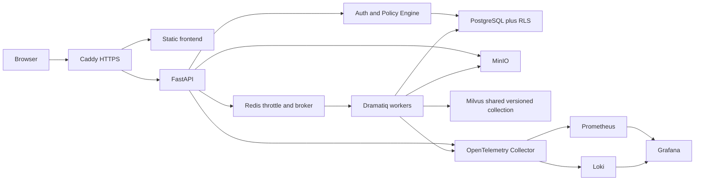

# Phase 6 Local Production Architecture Design

## 1. Goal and scope

Phase 6 turns the single-user local demo into a reproducible, locally deployed,
multi-user system with production-shaped security and operations. It does not buy
or configure a cloud server. A future cloud move should replace infrastructure
configuration rather than business contracts.

In scope: PostgreSQL, RLS, invitation authentication, fixed RBAC, MinIO uploads,
Redis/Dramatiq jobs, layered quotas, Caddy HTTPS/static hosting, profiled Compose,
OpenTelemetry, backup/restore drills and final portfolio documentation. Existing
SQLite data is not migrated. SQLite remains a unit-test adapter only.

## 2. Non-functional requirements

- Local scale: 1–20 users, up to 5 concurrent research runs per tenant.
- Auth/read API p95 target: 300 ms excluding model/tools; SSE first event <= 1 s.
- No cross-tenant read/write in API, Repository, workers, direct SQL or retrieval.
- Private traffic uses TLS at the browser boundary; secrets never enter Git/logs.
- Backup objectives: RPO <= 1 hour and RTO <= 2 hours, proven by restore drill.
- Audit and runtime metadata retention: 90 days.
- `core` runs independently; `rag` and `observability` are optional profiles.
- Formal claims require PostgreSQL integration evidence, not SQLite smoke.

## 3. Architecture

PostgreSQL is the source of identity, authorization, jobs, cases, runs, evidence,
memory and object metadata. Redis is disposable delivery/rate-limit state. MinIO
owns object bytes. Milvus is a rebuildable ranker and never authorizes access.

## 4. Identity, tenancy and authorization

Models: `users`, `tenants`, `memberships`, `invitations`, `refresh_token_families`,
`refresh_tokens`, `security_events`. Bootstrap is an explicit CLI command. An owner
invites members; anonymous registration is absent. Roles are fixed:

| Capability | owner | member | viewer |
|---|---:|---:|---:|
| Manage tenant/members/invitations | yes | no | no |
| Create research and upload | yes | yes | no |
| Manage own private memory | yes | yes | no |
| Read allowed runs/reports/evidence | yes | yes | yes |
| Backup/restore or tenant deletion | yes | no | no |

Every request resolves `PrincipalContext(user_id, tenant_id, role)`. A transaction
sets PostgreSQL session-local principal variables; RLS defaults deny when missing.
Workers receive only job IDs and revalidate membership, permission and resource
state. Resource-not-found and unauthorized responses are intentionally indistinct.
The worker resolves only `(tenant_id, user_id, role)` through a fixed-search-path,
non-public PostgreSQL function, claims the job with a random fencing token, then
exchanges that live claim for a separate run lease. Neither a broker message nor
an expired/stale claim is an execution capability.

Passwords use Argon2id. Access tokens last 15 minutes. Refresh tokens last seven
days, rotate on every use and detect family replay. Invitation and refresh tokens
are stored only as hashes. Signing keys support an overlap rotation window.
The browser receives refresh tokens only through Secure, HttpOnly, SameSite=Strict
cookies; access tokens remain in page memory. Logout revokes the current refresh
family server-side. Authentication and costly writes use Redis sliding windows
that fail closed.

## 5. Database boundary

SQLAlchemy 2 Core defines explicit statements and transaction helpers; Alembic
owns PostgreSQL migrations. The PostgreSQL Repository is the formal runtime. CAS,
lease, checkpoint and job claims retain affected-row assertions. Tests attack RLS
using direct SQL, missing context and stale workers. SQLite tests remain contract
smoke but cannot certify deployment. No legacy data migration is built; seed
commands create demo tenants, members and fixtures.

## 6. Object and retrieval flow

An authorized member requests an upload slot. The API validates quota, declared
MIME and size, creates a pending object row and returns a short presigned MinIO URL.
A worker verifies actual bytes, size, hash and detected type before moving the
object from quarantine to an opaque tenant/version key and creating ingestion.
Unverified objects never enter RAG. Downloads first pass PostgreSQL/RLS and policy
checks, then receive a short-lived URL. Deletion is tombstone-first and a worker
removes exact object and derived IDs before completion.

PostgreSQL computes authorized document IDs before Milvus search. Milvus tenant
metadata is defense in depth only. Collection upgrades build a new version,
validate it and atomically switch an alias.

## 7. Jobs, throttling and failures

PostgreSQL job states are authoritative. Dramatiq messages contain only `job_id`.
A worker transaction claims with token/expiry; heartbeats renew long work. Success
persists before message acknowledgement. A reconciler republishes pending/stale
jobs. Retryable failures use exponential backoff; permission, validation and budget
failures fail closed; exhausted jobs enter dead letter for owner retry.

Redis sliding windows protect login, user/tenant API, uploads and research cost.
Redis failure denies auth and costly writes; selected authenticated reads may use
a bounded local degradation guard.

## 8. Edge, secrets and email

Caddy serves versioned assets, applies SPA fallback, proxies API/SSE and sets CSP,
local HTTPS, nosniff, frame restrictions, limits and timeouts. Stateful ports remain
internal; admin UIs bind localhost. Docker Secrets and ignored local key files hold
credentials. Mailpit captures invitations locally through the SMTP abstraction.
The email points to a dedicated invitation page that keeps the one-time token in
memory only, removes it from the address bar with `history.replaceState`, accepts
the invitation, and hands the new member to the normal refresh-cookie flow.

## 9. Observability and retention

Trace context flows through request, routing, planning, job delivery, tools,
retrieval and reports. Metrics cover latency, queue age, retries, lease loss, limits,
budgets and RAG quality. JSON logs carry IDs/reason codes, not passwords, tokens,
private bodies or deleted memory. Metadata is deleted after 90 days unless frozen.

## 10. Backup and recovery

The local operator can create an encrypted full PostgreSQL/MinIO bundle with a
hashed manifest, schema revision, embedding profile and collection metadata.
`pg_dump` and the authoritative ready-object inventory are taken from one exported
PostgreSQL snapshot. MinIO collection follows that exact key/size/SHA-256 list;
quarantine and tombstoned bytes are excluded, and missing or changed ready bytes
fail the backup closed. A
Windows Scheduled Task installer can run this hourly; it is opt-in and its RPO
remains a target until installed. The isolated drill restores PostgreSQL into a
temporary database, verifies the Alembic head, restores MinIO into a temporary
bucket, checks hashes and deletes both targets. Milvus remains rebuildable and is
not included in this core backup. The current local drill measured 5.0 seconds;
that is evidence for this dataset, not a production capacity guarantee.

## 11. Verification gates

- PostgreSQL fresh/upgrade/rollback/future migration tests.
- RLS direct-SQL, cross-tenant, missing-context and role matrix tests.
- Refresh rotation/replay, invitation expiry, brute-force and redaction tests.
- Upload quarantine, spoofed MIME, hash mismatch, authorized download/delete.
- Duplicate delivery, crash, lease expiry, permission revocation and DLQ.
- Redis/MinIO/Milvus/PostgreSQL failure matrices and Compose profile health.
- Encrypted backup and isolated restore with measured RPO/RTO.
- Full eval regression and independent subagent review before user acceptance.
